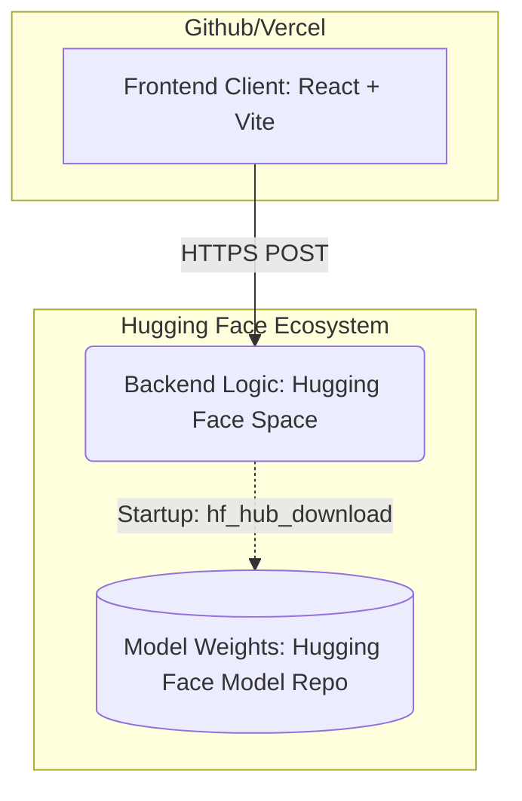

# Parsify OCR - System Architecture
This document outlines the decoupled, production-grade MLOps architecture powering the **Parsify Multi-Lingual OCR Engine**. By separating the data, logic, and user interface, the system achieves instant deployment cycles, cloud-native scalability, and maximum stability.
## High-Level Architecture
The ecosystem relies on three independent pillars:

---
## 1. The Interface: React Frontend (GitHub / Vercel)
The presentation layer that the user interacts with. 
- **Tech Stack:** React, Vite, Axios, Vanilla CSS (Glassmorphism).
- **Location:** Typically deployed to **Vercel** or **Netlify** via GitHub.
- **Purpose:** Handles extremely fast UI rendering, client-side interactions, file selection, and blasting image arrays over the internet securely to the AI API.
**Why it's decoupled:** If you want to change button colors or add a new animation, you shouldn't have to reboot heavy Python AI engines or wait 5 minutes for a massive Docker container to spin up. Frontend deployments to Vercel happen in milliseconds.
---
## 2. The Engine: AI API (Hugging Face Space Repository)
The brain of the operation. This acts as your live active web server.
- **Location:** `Angstormy/hindi-ocr-api` (Space Repo).
- **Core Files:** `api.py`, `requirements.txt`.
- **Purpose:** A lightweight FastAPI Docker container listening on port `7860`. It accepts incoming POST requests from the Frontend, processes the raw vision inference via PyTorch and Transformers, and returns the strictly-decoded JSON prediction.
**Why it's decoupled:** Hugging Face Spaces strictly limit application code to `<1GB` to ensure rapid builds. Because we moved the massive AI models *out* of this folder, this Space calculates as less than `10 KB`. A tweak to the preprocessing layer in `api.py` will deploy and reboot in seconds rather than crashing the cloud server.
---
## 3. The Fuel: Model Weights (Hugging Face Model Repository)
The massive data vault that holds the underlying neural networks.
- **Location:** `Angstormy/parsify-ocr-weights` (Model Repo).
- **Core Files:** `best_model_20k.pt` (Hindi), `trocr-base-english/` (English safetensors).
- **Purpose:** Hosted on heavy-duty LFS (Large File System) servers that permit massive payloads (up to 50 GB free).
**How it connects:** When the **API Space** wakes up from a cold-boot, the *first thing it does* is use `hf_hub_download()` to dynamically stream these optimized weights straight into its container RAM.
**Why it's decoupled:** AI models are enormous. If you embedded them into the API Space, your server startup times would be brutal, and pushing Git commits would take ages. By separating them into a Vault, you only ever need to push weights once. If you train a better notebook in Colab tomorrow, you just drop the new `.pt` file here, and the server automatically begins using it on its next request.
---
## Operational Commands
To interact with each specific layer, use the following:
### Updating the Frontend (UI)
```bash
# Push changes to Github (Triggers Vercel auto-deploy)
cd frontend
git add .
git commit -m "Update UI"
git push origin main
```
### Updating the Logic (Backend Server)
```bash
# Deploys api.py cleanly to your HF Space
python deploy.py
```
### Updating the Weights (New Models)
```bash
# Only run this if you retrain your AI in Colab and have new .pt files!
python deploy_models.py
```
