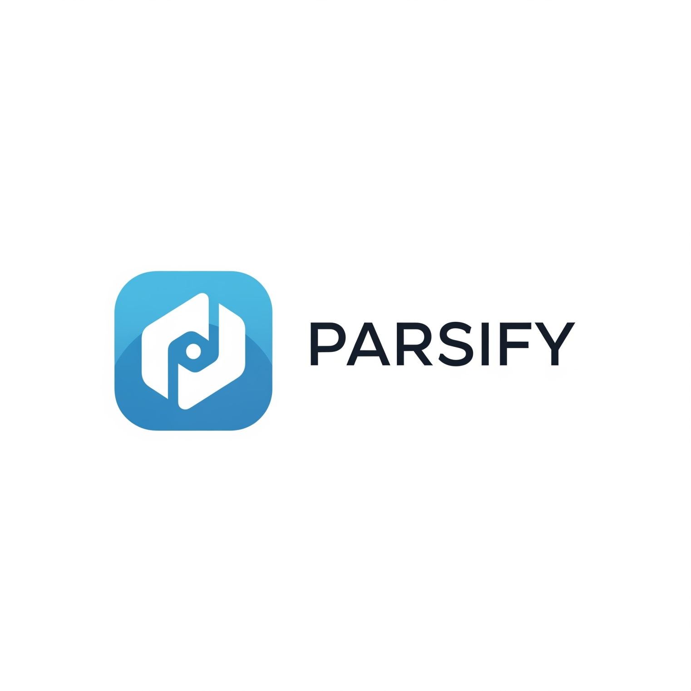

# Parsify

A modern, AI-powered Hindi OCR (Optical Character Recognition) web application built with React and TailwindCSS. Extract text from Hindi documents with ultra-precision using our advanced OCR engine.



## Features

- **Hindi OCR Engine** - Extract text from Hindi images with high accuracy
- **Drag & Drop Upload** - Simple and intuitive file upload interface
- **Real-time Preview** - See your uploaded documents instantly
- **Copy to Clipboard** - Easily copy extracted text with one click
- **Debug Vision** - Visual debugging output for OCR processing
- **Responsive Design** - Modern dashboard UI that works across devices
- **Multi-section Navigation** - Sidebar with coming soon features:
  - Summarization (OCR - Active)
  - Sentiment Analysis
  - MepotinaTone
  - Advanced Features
  - Adanias Settings

## Tech Stack

- **Framework**: React 19.2.4
- **Build Tool**: Vite 8.0.1
- **Styling**: TailwindCSS 4.2.2 with @tailwindcss/postcss
- **Icons**: Lucide React
- **HTTP Client**: Axios 1.13.6
- **Language**: JavaScript (ES6+) with TypeScript support

## Project Structure

```
src/
├── components/
│   ├── features/
│   │   ├── ComingSoon.jsx      # Placeholder for upcoming features
│   │   ├── ExtractedText.jsx   # OCR results display with copy button
│   │   ├── PDFViewer.jsx       # File upload and preview component
│   │   └── UploadSection.jsx   # Upload button with loading states
│   └── layout/
│       ├── Header.jsx          # Top header with account dropdown
│       ├── MainLayout.jsx      # Main layout wrapper
│       └── Sidebar.jsx         # Navigation sidebar with logo
├── hooks/
│   └── useOCR.js               # Custom hook for OCR state management
├── services/
│   └── api.js                  # API service for backend communication
├── styles/
│   └── globals.css             # TailwindCSS v4 configuration
└── assets/
    ├── Parsify.png             # Application logo
    └── hero.png                # Hero image assets
```

## Getting Started

### Prerequisites

- Node.js 18+ 
- npm or yarn

### Installation

1. Clone the repository:
```bash
git clone <repository-url>
cd parsify
```

2. Install dependencies:
```bash
npm install
```

3. Start the development server:
```bash
npm run dev
```

The application will be available at `http://localhost:5174`

### Build for Production

```bash
npm run build
```

## API Integration

The application connects to a Hindi OCR API endpoint:
- **Endpoint**: `https://angstormy-hindi-ocr-api.hf.space/predict`
- **Method**: POST
- **Payload**: FormData with image file

## Key Components

### OCR Workflow

1. **Upload**: Drag & drop or click to select an image (JPG, PNG, WEBP)
2. **Preview**: View the uploaded document in the left panel
3. **Process**: Click "Upload Image" to send to OCR API
4. **Extract**: View extracted Hindi text in the right panel
5. **Copy**: Click "Copy Text" to copy results to clipboard

### Sidebar Navigation

- Click any menu item to switch sections
- Active section highlighted with primary color
- Non-active sections show "Coming Soon" placeholder
- No page reload - seamless React state transitions

### Account Dropdown

- Profile management
- Settings access
- Notifications
- Logout functionality

## Configuration

### TailwindCSS v4

The project uses TailwindCSS v4 with the new `@import` syntax:

```css
@import "tailwindcss";

@theme {
  --color-primary-50: #eff6ff;
  --color-primary-100: #dbeafe;
  --color-primary-500: #3b82f6;
  --color-primary-600: #2563eb;
  --color-primary-700: #1d4ed8;
  --color-secondary-500: #8b5cf6;
  --color-secondary-600: #7c3aed;
}
```

### Axios Version

This project uses Axios version `1.13.6` (pinned). See [CHANGELOG.md](./CHANGELOG.md) for version history.

## Development

### Available Scripts

- `npm run dev` - Start development server
- `npm run build` - Build for production
- `npm run preview` - Preview production build

### Folder Organization

- **Components**: Organized by feature and layout
- **Hooks**: Reusable state logic (useOCR)
- **Services**: API communication layer
- **Styles**: Global CSS with Tailwind configuration

## Browser Support

- Chrome 90+
- Firefox 88+
- Safari 14+
- Edge 90+

## License

© 2026 Parsify Intelligence. All rights reserved.

## Contributing

Contributions are welcome! Please follow the existing code style and structure when submitting PRs.

## Support

For support or feature requests, please contact the development team or open an issue.

---
## 1. The Interface: React Frontend (GitHub / Vercel)
The presentation layer that the user interacts with. 
- **Tech Stack:** React, Vite, Axios, Vanilla CSS (Glassmorphism).
- **Location:**  Deployed to **Vercel** via GitHub.
- **Purpose:** Handles extremely fast UI rendering, client-side interactions, file selection, and blasting image arrays over the internet securely to the AI API.
**Why it's decoupled:** If you want to change button colors or add a new animation, you shouldn't have to reboot heavy Python AI engines or wait 5 minutes for a massive Docker container to spin up. Frontend deployments to Vercel happen in milliseconds.
---
## 2. The Engine: AI API (Hugging Face Space Repository)
The brain of the operation. This acts as your live active web server.
- **Location:** `Angstormy/hindi-ocr-api` (Space Repo).
- **Core Files:** `api.py`, `requirements.txt`.
- **Purpose:** A lightweight FastAPI Docker container listening on port `7860`. It accepts incoming POST requests from the Frontend, processes the raw vision inference via PyTorch and Transformers, and returns the strictly-decoded JSON prediction.
- **Why it's decoupled:** Hugging Face Spaces strictly limit application code to `<1GB` to ensure rapid builds. Because we moved the massive AI models *out* of this folder, this Space calculates as less than `10 KB`. A tweak to the preprocessing layer in `api.py` will deploy and reboot in seconds rather than crashing the cloud server.
---
## 3. The Fuel: Model Weights (Hugging Face Model Repository)
The massive data vault that holds the underlying neural networks.
- **Location:** `Angstormy/parsify-ocr-weights` (Model Repo).
- **Core Files:** `best_model_20k.pt` (Hindi), `trocr-base-english/` (English safetensors).
- **Purpose:** Hosted on heavy-duty LFS (Large File System) servers that permit massive payloads (up to 50 GB free).
- **How it connects:** When the **API Space** wakes up from a cold-boot, the *first thing it does* is use `hf_hub_download()` to dynamically stream these optimized weights straight into its container RAM.
- **Why it's decoupled:** AI models are enormous. If you embedded them into the API Space, your server startup times would be brutal, and pushing Git commits would take ages. By separating them into a Vault, you only ever need to push weights once. If you train a better notebook in Colab tomorrow, you just drop the new `.pt` file here, and the server automatically begins using it on its next request.

---
- Built with ❤️ using React, Vite, and TailwindCSS.
- Developed by OMKAR